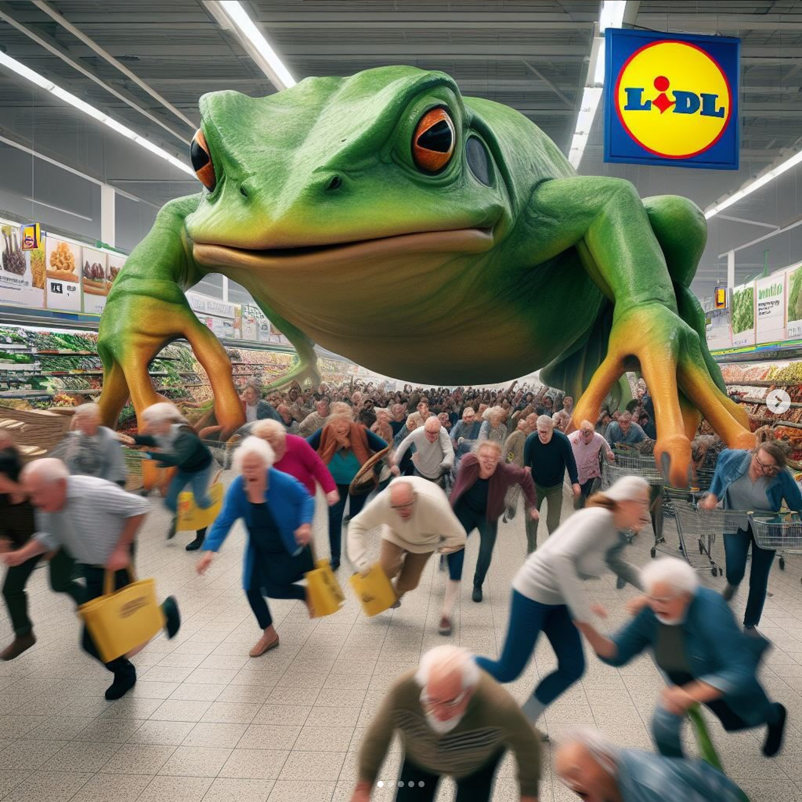

+++
title = 'Art & Artificial Inteligence'
date = 2024-11-10T22:23:23+01:00
draft = false
+++

## Snowww Crshahs - Constant Dullaart

===> Rewrite, make shorter
his pile of covers displays the various Al interpretations of Neil Stephenson's 1992 novel Snow Crash. Hazily conjured as Al was nodding off while reading Hiro Protagnists's adventures battling a religion-spreading virus spreading through brains. His figure reaches out to us mystifyingly, recognizable but only like through a lucid dream - he appears to us in the only possible moment he could have: any earlier and the Al tools necessary to generate him would not have been available publicly open-source, any later and the delirious errors of Al would have been filtered out. It's a technological window in time we may forget about eventually, but worth commemorating before it's gone." - from the catalogue for the solo show 'Sunsetting Inconsistencies' at Upstream Gallery Bamboo, polysterol ink and glue.

https://www.constantdullaart.com/projects/snowww-crshahs

https://www.constantdullaart.com/img/12/6602cf8883b38.jpg

## Image Operations - Trevor Paglen

https://www.youtube.com/watch?v=jfuYG5Erik8

https://paglen.studio/2020/05/22/clouds/

## Hallucionations - Trevor Paglen

https://paglen.studio/2020/04/09/hallucinations/

https://paglen.studio/wp-content/uploads/2020/06/Palgen-Vampire_2017.jpg

## Fanon - Trevor Paglen

https://paglen.studio/2020/04/09/fanon/
https://paglen.studio/wp-content/uploads/2020/05/Paglen-Fanon_2017.jpg

## Anatomy of an AI System - Kate Crawford & Vladan Joler

An anatomical case study of the Amazon echo as a artificial intelligence system made of human labor.

https://anatomyof.ai/

https://anatomyof.ai/img/mechanical-turk.svg

## Calculating Empires - Kate Crawford & Vladan Joler

https://calculatingempires.net/

## Chat Show - Metazoa (Barbora Trnková, Tomáš Javůrek)

https://chatshow.metazoa.org/

## Generace Princezen - Metazoa (Barbora Trnková, Tomáš Javůrek)

https://generaceprincezen.cz/

## Text to Speech - Metazoa (Barbora Trnková, Tomáš Javůrek)

Text To Speech is the first world human-based Text-To-Speech engine ever. The first release was introduced by & (Barbora Trnková & Tomáš Javůrek) in the Brno gallery OFF/Format in 2015. Three czech Voices were used there: Saša, Eliška and René.

https://www.youtube.com/watch?v=8d_xSpAXbsE

## Jakub Polách

## Additional sources

### The Atlas of AI: Power, Politics, and the Planetary Costs of Artificial Intelligence - Kate Crawford

==> Make shorter, rewite:
The hidden costs of artificial intelligence, from natural resources and labor to privacy and freedomWhat happens when artificial intelligence saturates political life and depletes the planet? How is AI shaping our understanding of ourselves and our societies? In this book Kate Crawford reveals how this planetary network is fueling a shift toward undemocratic governance and increased inequality. Drawing on more than a decade of research, award-winning science, and technology, Crawford reveals how AI is a technology of extraction: from the energy and minerals needed to build and sustain its infrastructure, to the exploited workers behind “automated” services, to the data AI collects from us. Rather than taking a narrow focus on code and algorithms, Crawford offers us a political and a material perspective on what it takes to make artificial intelligence and where it goes wrong. While technical systems present a veneer of objectivity, they are always systems of power. This is an urgent account of what is at stake as technology companies use artificial intelligence to reshape the world.

https://library.memoryoftheworld.org/#/book/03d27135-1664-4e96-9823-39523644c0c5

## Institutions

### Generative Media @ Akademie der Bildende Kunste Munich
https://generativemedia.net/information-for-students/
