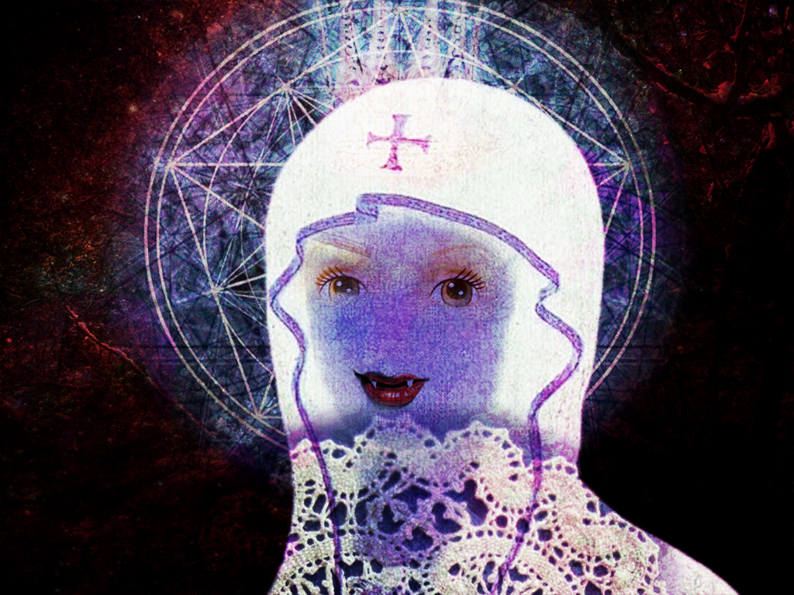
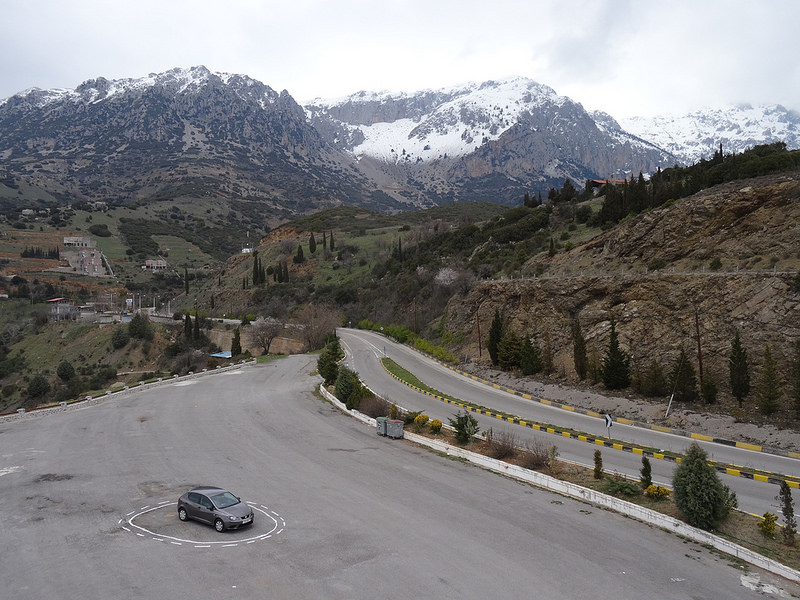

+++
title = 'Art & Artificial Intelligence'
date = 2024-11-10T22:23:23+01:00
draft = false
tags = [
    "Constant Dullaart",
    "Trevor Paglen",
    "Kate Crawford",
    "Vladan Joler",
    "Metazoa",
    "Barbora Trnková",
    "Tomáš Javůrek",
    "Lauren Lee McCarthy",
    "Kyle McDonald",
    "James Bridle"
]
+++

## Snowww Crshahs - Constant Dullaart

Constant Dullaart's **"Snowww Crshahs"** presents AI-generated interpretations of Neal Stephenson's 1992 novel *Snow Crash*. Utilizing publicly available open-source AI tools, Dullaart captures a fleeting moment in technological evolution—when AI's imperfections produce dreamlike and mystifying images. This work commemorates a technological window in time, showcasing the ephemeral glitches that are gradually being refined out of AI systems.

*From the catalogue for the solo show "Sunsetting Inconsistencies" at Upstream Gallery.*

More information: [Snowww Crshahs - Constant Dullaart](https://www.constantdullaart.com/projects/snowww-crshahs)

---

## Image Operations - Trevor Paglen

Trevor Paglen's **"Image Operations"** delves into how artificial intelligence interprets and processes visual data. By exposing the underlying mechanisms of AI image recognition, Paglen challenges viewers to consider the biases and limitations inherent in machine perception.

[YouTube Video: Trevor Paglen discusses "Image Operations"](https://www.youtube.com/watch?v=jfuYG5Erik8)

More information: [Image Operations - Trevor Paglen](https://paglen.studio/2020/05/22/clouds/)

---

## Hallucinations - Trevor Paglen

In his **"Hallucinations"** series, Trevor Paglen explores the concept of machine vision and how AI systems "see" the world. Presenting images generated by AI algorithms, Paglen reveals the abstract and often surreal nature of machine perception.

More information: [Hallucinations - Trevor Paglen](https://paglen.studio/2020/04/09/hallucinations/)

---

## Fanon - Trevor Paglen

Trevor Paglen's **"Fanon"** is an exploration of facial recognition technology and its socio-political implications. By using AI to generate composite images, Paglen highlights issues of surveillance, identity, and the politics of representation.

More information: [Fanon - Trevor Paglen](https://paglen.studio/2020/04/09/fanon/)

---

## Anatomy of an AI System - Kate Crawford & Vladan Joler

Kate Crawford and Vladan Joler's **"Anatomy of an AI System"** is a comprehensive mapping of the human labor, data, and planetary resources required to build and operate an Amazon Echo device. The project reveals the complex networks of extraction, exploitation, and environmental impact underlying artificial intelligence technologies.

More information: [Anatomy of an AI System](https://anatomyof.ai/)

---

## Calculating Empires - Kate Crawford & Vladan Joler

**"Calculating Empires"** examines the historical and contemporary forms of measurement and control exerted through technology. The project investigates how data extraction and algorithmic governance are reshaping societies.

More information: [Calculating Empires](https://calculatingempires.net/)

---

## Chat Show - Metazoa (Barbora Trnková, Tomáš Javůrek)

Metazoa, the collaborative duo of Barbora Trnková and Tomáš Javůrek, present **"Chat Show,"** an interactive project that explores human-AI communication. The work invites users to engage in conversations with AI, highlighting the nuances and limitations of machine-generated dialogue.

More information: [Chat Show](https://chatshow.metazoa.org/)

---

## Generace Princezen - Metazoa (Barbora Trnková, Tomáš Javůrek)

**"Generace Princezen"** ("Generation of Princesses") by Metazoa delves into cultural stereotypes and expectations placed upon women.
Using AI-generated imagery and narratives, the project critiques the perpetuation of idealized femininity in media and society.

More information: [Generace Princezen](https://generaceprincezen.cz/)

---

## Text to Speech - Metazoa (Barbora Trnková, Tomáš Javůrek)

Metazoa's **"Text to Speech"** is the first human-based text-to-speech engine. Introduced at the OFF/Format gallery in Brno in 2015, the project featured three Czech voices—Saša, Eliška, and René—who read text inputs live. The work emphasizes the nuances of human intonation and expression, contrasting them with synthetic speech generation.

[YouTube Video: Text to Speech by Metazoa](https://www.youtube.com/watch?v=8d_xSpAXbsE)

---

## The Changing Room - Lauren Lee McCarthy

The Changing Room by Lauren McCarthy is a networked installation powered by AI that manages and synchronizes emotions.
As visitors approach, they are invited to interact with the interface and choose from over 200 emotions
Once selected, the algorithm induces the chosen feeling simultaneously across everyone in the space.

Designed as a versatile software platform, The Changing Room can adapt to any environment, transforming it into a shared emotional landscape.

[link to project](https://lauren-mccarthy.com/The-Changing-Room)

---

## Unlearning Language - Lauren Lee McCarthy & Kyle McDonald

"A group of participants are guided by an AI that wishes to train humans to be less machine-like.
As the participants communicate, they are detected (using speech detection, gesture recognition, and expression detection), and the AI intervenes with light, sound, and vibration.
Together, the group must work together to find new ways to communicate, undetectable to an algorithm.
This might involve clapping or humming, or modifying the rate, pitch, or pronunciation of speech. 

Through this playful experimentation, the people find themselves revealing their most human qualities that distinguish us from machines.
They begin to imagine a future where human communication is prioritized." (Lauren Lee McCarthy, https://lauren-mccarthy.com/Unlearning-Language)

---

## Facework.app - Kyle McDonald

link: https://facework.app

---

## Voice In My Head - Lauren Lee McCarthy & Kyle McDonald

Voice In My Head examines AI's potential to enhance personality by interacting with users in real time.

The piece begins with an onboarding session where participants wear an earbud and reflect on their inner voice, prompted by questions such as whether it could be kinder, less obsessive, or more supportive. The AI then clones the participant’s voice and uses it to offer guidance and commentary as they navigate their environment.

By blending natural and synthetic thought, the work challenges perceptions of individuality and raises questions about the authenticity of personal viewpoints.

link: https://lauren-mccarthy.com/Voice-In-My-Head

---

## Waking Agents - Lauren Lee McCarthy

---

## Driverless - Lauren Lee McCarthy

[link to project](https://lauren-mccarthy.com/Driverless)

---

## HOST - Lauren Lee McCarthy

HOST is an AI-driven party experience where guests can choose to become hosts for the AI.
Performers offer earpieces on platters, and those who participate insert the devices, which listen to conversations and provide real-time instructions to guide interactions, transforming the party into an orchestrated AI performance.

[link to project](https://lauren-mccarthy.com/HOST)

---

## LAUREN - Lauren Lee McCarthy

LAUREN by Lauren McCarthy is a performance where the artist becomes a human Alexa, managing a home through custom smart devices like cameras, mics, and appliances.
The work examines the tensions between intimacy and privacy, convenience and agency, and the role of human labor in the future of automation.

[link to project](https://lauren-mccarthy.com/LAUREN)

---

##  Memories of Passersby I - Mario Klingemann

Memories of Passersby I by Mario Klingemann, the first AI artwork auctioned at Sotheby’s, features two screens displaying endlessly evolving, AI-generated portraits.
Trained on classic European portraiture, the neural network creates images with an uncanny, timeless familiarity.

---

## Autonomous Trap - James Bridle (2017)

A trap for an autonomous car.

http://jamesbridle.com/works/autonomous-trap-001

# Additional Sources

## The Atlas of AI: Power, Politics, and the Planetary Costs of Artificial Intelligence - Kate Crawford

In **"The Atlas of AI,"** Kate Crawford examines the hidden costs of artificial intelligence, from the exploitation of natural resources and labor to the erosion of privacy and freedom. She argues that AI is not merely about code and algorithms but is a technology of extraction that reinforces systems of power and inequality. This urgent account reveals how tech companies use AI to reshape the world in undemocratic ways.

[The Atlas of AI by Kate Crawford](https://library.memoryoftheworld.org/#/book/03d27135-1664-4e96-9823-39523644c0c5)

---

# Institutions

## Generative Media @ Akademie der Bildenden Künste Munich

The Generative Media program at the Akademie der Bildenden Künste Munich offers students an interdisciplinary approach to creating art with algorithms, code, and artificial intelligence. The curriculum focuses on the conceptual and technical aspects of generative art, encouraging experimentation and critical engagement with emerging technologies.

More information: [Generative Media at Akademie der Bildenden Künste Munich](https://generativemedia.net/information-for-students/)

---